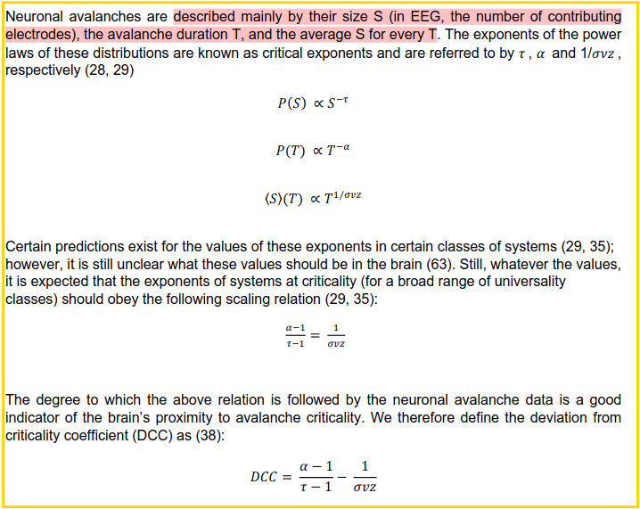

# EEG data from external study

Data comes from a [different study](https://linkinghub.elsevier.com/retrieve/pii/S0960982215012427)

## participants

- 15 healthy adults
- 5 propfol, 5 xenon, 5 ketamine

## Recording

- atleast 5min resting wakefullness
- 3-5min of ansthesia (ramsey scale of 6 or lower)
- 60 channel EEG
- referenced to external electrode on the forehead
- online filter 0.1-350Hz
- fs 1450
- two eog channels

## Preprocessing

- offline 0.5-40Hz 3rd order butterworth with -3db at stopband (matlab filtfilt)
- bad channels rejected based on visual inspection (less than 10%)
- rejected eeg channels interpolated with spherical splines
- 2 second segments
- movement segments excluded based on visual inspection
- singular value decomposition to reduce the number of independent components to the number of good, non interpolated
  channels
- Ica using EEGLAB routines to remove ocular, muscle and electrocardiograph artifacts
- Data spans of 265+-64s (cleaned) EEG data available for every participant

# Metric calculation

## Avalance criticallity

### Prepare data for avalance detection

- z-transformed channels wise
- plotted in probability distribution spanning +- 10SD
- averaged distributions across all participants within same condition
- gaussian fit to each distribution
- binarization threshhold = point of divergence from distribution
- binarized: 0 for inside threshhold, 1 for outside

### Details of how avalanches are identified in binarized data

- multichannel analysis to find avalanches
- find 1 one in one channel: start of avalanche
- continue as long as there is atleast one channel with a 1
- end if condition is not met and start again at next 1

### Characteristics of avalanches

- Size (S): number of channels with a 1 during avalanche
- Duration (T): number of samples during avalanche
- 

### Branching parameter (m)

- measure of activity propagation
- branching parameter (m): number of channels with a 1 during avalanche divided by the number of channels with a 1
  during the previous avalanche
- m = S(t)/S(t-1) averaged over all time bins
- t: a timebin in which an event can occur
- replicated using time bins of 1-12 ms as m is sensitive to time bin size

### repertoir size and similarity

- Repertoir size: number of unique avalanche patterns normalized to signal length
- Repertoir diversity: median normalized hamming distance between all unique patterns

### Fano factor (FF)

- measure of variability of a signal
- FF = $\frac{\sigma^2}{\mu^2}$

## Edge of chaos analysis

### Modified 0-1 chaos test (K)

- edgeofpy implementation of tokers code
- median across all electrodes of mean over time of every channel and non overlapping 10s epoch
- replicated with low pass filter of 1 to 12Hz

### Largest Lyapunov exponent (LLE)

- Neurokit 2 implementation
- rosenstein method
- reconstruction of signal state space
    - delay-embedding with delay=1 and m=2
- closest neighbor method
    - euclidian distance
- detect slope
    - least square fit
- every channel of non overlapping 10s epoch
- averaged over time
- averaged over channels?

### Width of covariance matrix

- integrated time lagged covariance matrix
- standard deviation of the off diagonal elements of the covariance matrix divided by the mean of the diagonal elements
- edgeofpy package

## Criticallity related measures

### Detrended fluctuation analysis

- Neurokit2 implementation of DFA
- maximum of 200s of data for analysis
- each channel individually (using all available data)
- scales of 1 to 20s
- amplitude envelope of delta, theta, alpha, beta, gamma
- absolute value of signals hilbert transform
- every epoch and channel individually and averaged over time

### Spectral slope

- FOOOF package
- welch method
- 10s epoch for each channel individually
- freq 1-40 Hz
- averaged afterwards

### Complexity (LZC)

- univariate LZC
- Neurokit2
- 10s epoch on every channel individually and averaged afterwards
- binarized with each channel and epoch mean individually
- normalized to length of signal

### Multiscale entropy

- neurokit2
- sample entropy on multiple time scales
- optimal embedding dimension using average false neareast neighbors
- sum of sample entropy values over all scales

### Fractal dimension

- neurokit2
- katz fractal dimension

### Pair correlation function (PCF)

- edgeofpy
- downsampled to 250Hz
- alpha freq (8-13Hz)
- non overlapping 10s epochs individually and averaged over time

